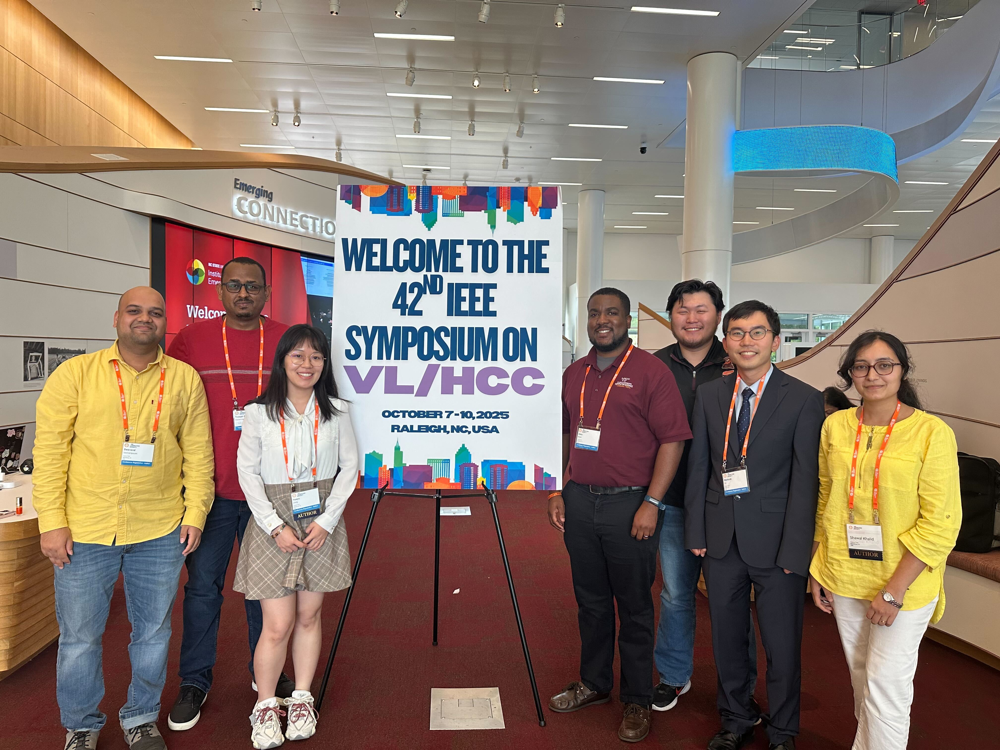

# VL/HCC 2025 Overview

We had numerous contributions accepted and presented at the AIEEE Symposium on Visual Languages and Human-Centric Computing ([VL/HCC 2025](https://conf.researchr.org/home/vlhcc-2025)) conference. This post summarizes the workshop and main conference contributions from our research group this year. A summary of all the contributions from Virginia Tech are highlighted in [this new article](https://hci.icat.vt.edu/news/chci-vt-prominently-featured-at-ieee-vl-hcc-2025.html) from the Center for Human-Computer Interaction at VT (CHCI@VT).

### Workshop: Designing for Everyone

**Do LLM-Generated Resumes Make Me More Qualified? An Observational Study of LLMs For Resume Generation and Matching Tasks**

Swanand Vaishampayan, Chris Brown

* :mag: **Problem:** Large language models (LLMs) are increasingly used to support resume-related hiring tasks for employers and candidates---such as automatically matching resumes to job description requirements and generating or tailoring resume content. However, LLMs can integrate challenges in hiring contexts, such as biased rankings or resume whitening.

* :test_tube: **Study:** We conducted in _observational study_ to explore the performance of LLMs---GPT-4, Gemini, and Claude---on resume matching and resume generating tasks. For our preliminary study, we leveraged a dataset of real-world resumes from disabled (n = 209) and non-disabled (n = 209) candidates across domains to investigate potential bias.

* :bar_chart: **Findings:** We observed moderate alignment across LLMs for resume matching tasks. We found traces of resume whitening (i.e., removing of disability markers) for resume generating tasks. Finally, we found instances of models exhibiting self-preference---or significantly preferring LLM-generated resumes in ranking tasks compared to human-generated resumes.

* :bulb: **Implications:** We provide design guidelines for enhancing the design of tools for supporting resume matching and resume generation tasks to improve hiring pipelines for candidates and employers.

**Understanding User Perceptions of Automated Dark Pattern Detection Online**

Ryan Wood, Chris Brown
Presented by: Huayu Liang

* :mag: **Problem:** Dark patterns are deceptive design in online user interfaces (UIs) designed to trick users into adopting unintended behaviors. Recently, research is increasingly investigating automated tools to detect dark patterns in UIs---yet we lack knowledge on how automated dark pattern detection techniques impact user experiences online.

* :test_tube: **Study:**  We designed a technology probe, `Dark Pattern Detector`, a Google Chrome plugin to automatically detect select dark patterns online. We conducted a user study (n = 40) to explore the effectiveness and users' perceptions of our automated dark pattern detection tool. The study consisted of three tasks based on real-world examples of [previously defined dark patterns](https://www.deceptive.design/) (Disguised Ads, Hidden Costs, and Sneak Into Basket).

* :bar_chart: **Findings:** We found our system was mostly effective for notifying users of dark patterns during the study tasks. Most participants also had positive perceptions of `Dark Pattern Detector`, praising its usefulness and ability to raise awareness about deceptive designs.

* :bulb: **Implications:** We discuss implications for designing future automated dark pattern detection tools to safeguard users from deceptive designs online.

**ParticipantGuide: Promoting Transparency in Human-Centric User Studies**

Minhyuk Ko, Shawal Khalid, Chris Brown

* :mag: **Problem:** Human subjects research is critical for advancing human-computer interaction, however recruiting participants for studies is very challenging and burdensome.

* :bulb: **Idea:** Our extended abstract proposes _ParticipantGuide_, a method to inform potential subjects of study details to inform decisions about participation in research studies. We will explore this and additional methods to enhance participant recruitment processes in future work.

### Graduate Consortium

**AI-Guided Exploration of Large-Scale Codebases**

Yoseph Berhanu Alebachew

* :mag: **Problem:** Modern software systems are large, complex, and constantly evolving, creating challenges for developers to understand and contribute to codebases.

* :bulb: **Idea:** Yoseph will devise techniques to support LLM question-answering and interactive visualizations to support program comprehension.

### Main Conference

**Programmers Without Borders: Bridging Cultures in Computer Science Study Abroad Program**

Minhyuk Ko, Mohammed Seyam, Chris Brown

* :mag: **Problem:** Globalization and distributed development is common in modern software engineering practices, yet Computer Science students rarely have the opportunity to participate in study abroad programs offered by universities.

* :test_tube: **Study:** We interviewed students participating in the first iteration (Spring 2026) of a [novel SE-focused study abroad program](https://sa.globaleducation.vt.edu/_portal/tds-program-brochure?programid=12460) at Virginia Tech to understand students' experiences and impacts on their computing identity.

* :bar_chart: **Findings:** Overall, students found the experience rewarding---consisting of opportunities to experience working with individuals from different cultures and overcoming communication challenges. In addition, we found the program increased students' confidence in participating in a program and getting a full-time computing job after graduation.

* :bulb: **Implication:** We suggest ways to improve future study abroad programs for software engineering, and discuss takeaways for students and instructors based on our findings.

**AutoPrint: Judging the Effectiveness of An Automatic Print Statement Debugging Tool**

Minhyuk Ko, Omer Ahmed, Yoseph Berhanu Alebachew, Chris Brown

* :mag: **Problem:** Debugging is one of the most difficult tasks in software development, yet programmers primarily rely on print-statement debugging instead of advanced debugging tools.

* :test_tube: **Study:** We conducted a _judgment study_ where participants (n = 23) from academic and industry backgrounds were tasked with using `AutoPrint`, a system we implemented to automatically insert and delete print statements for debugging, in their normal programing activities. After approximately two weeks, we surveyed and interviewed participants to understand their perceptions of automated print statement debugging.

* :bar_chart: **Findings:** Participants used `AutoPrint` for diverse use cases, including working on school projects, personal projects, and web applications. Overall, we found participants viewed the tool fast, simple to use, and more effective than advanced dbugging tools---providing suggestions for UI improvements, AI integration, and automated bug fixing capabilities.

* :bulb: **Implication:** While we found `AutoPrint` was viewed as effective, _should_ we encourage tooling to support automated print statement debugging? We discuss future research directions o further evaluate automated print statement debugging and enhance the usability of more advanced debugging systems.

**Understanding User and Developer Perceptions of and Responses to Dark Patterns in Online UIs**

Huayu Liang, Syeda Afia Hossain, Chris Brown

* :mag: **Problem:** Dark patterns are increasingly integrated into UIs, however we lack knowledge on software developers'---those responsible for implementing software applications---perspectives on dark patterns.

* :test_tube: **Study:** We conducted two _surveys_ to understand dark pattern perceptions of users (n = 66) and developers (n = 38). We also conducted a _repository mining study_ to investigate themes and sentiments of discussions on GitHub related to dark patterns.

* :bar_chart: **Findings:** Users have negative perceptions of dark patterns, but are likely to ignore them due to their ubiquity in online UIs. Developers report rarely implementing dark patterns, but believe they have negative effects on users and support development standards to prevent deceptive designs. On GitHub, discussions about dark patterns primarily focus on their usage, prevention, and examples in software---with comments from developers consisting of significantly more negative sentiments and emotions than non-dark pattern comments.

* :bulb: **Implication:** We discuss implications for users, developers, and researchers to prevent and mitigate deceptive UI designs in software.

**Designing Conversational AI to Support Think-Aloud Practice in Technical Interview Preparation for CS Students**

Taufiq Daryanto, Sophia Stil, Xiaohan Ding, Daniel Manesh, Sang Won Lee, Tim Lee, Stephanie Lunn, Sarah Rodriguez, Chris Brown, Eugenia Rho

* :mag: **Problem:** Technical interviews are commonly used to assess software engineers for hiring, yet candidates rarely have opportunities for structured preparation---in particular for think aloud practice to verbalize problem-solving approaches while completing programming tasks.

* :test_tube: **Study:** We designed a technology probe to simulate technical interviews using conversational AI to support think aloud practice and feedback. We evaluated this preliminary system through a _user study_ (n = 17).
 
* :bar_chart: **Findings:** Participants found the conversational AI tech interview simulation ot be engaging and realistic to an actual interview and appreciated the feedback beyond verbal content analysis (i.e., feedback on pauses, filler words, etc.). Participants also perceived the system helped them learn and improve their performance for future interviews.

* :bulb: **Implication:** We provide design implications for AI-assisted systems and AI-generated feedback to support technical interview preparation. We also discuss the role of AI and human-AI collaboration for technical interview preparation.

VL/HCC 2025 was a great experience, and it was very meaningful to be back in Raleigh and on campus at NC State---which is where I completed my PhD :wolf: 

I also served as Workshop Co-Chair, Graduate Consortium Co-Chair, Session Chair, and the program committee for VL/HCC 2025, which were rewarding experiences. We received great feedback on these efforts from the research community, and looking forward to pursuing future work based on these papers. If you would like additional information or are interested in potential collaborations related to any of these projects, please feel free to reach out.