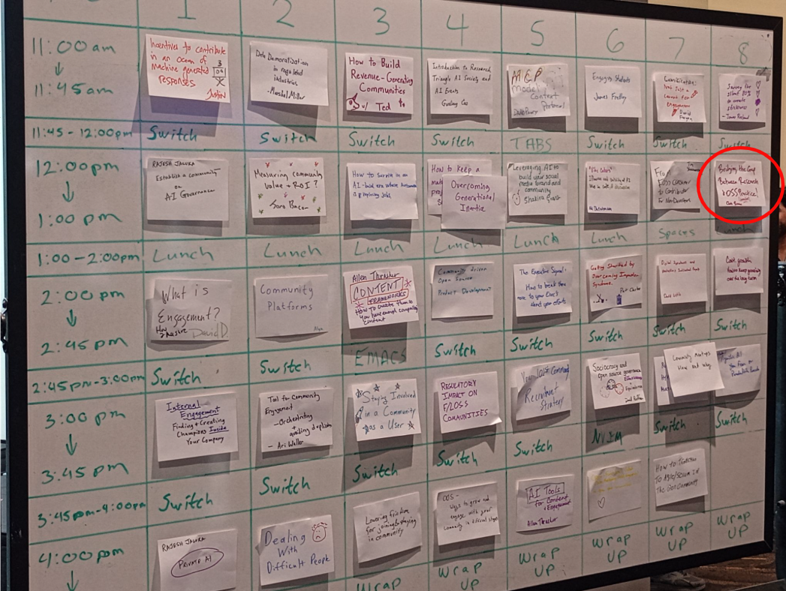

# Bridging the Gap Between Research and OSS Communities

### Reflections from the 2025 OSS Community Leadership Summit

I recently had the chance to attend the [Community Leadership Summit](https://2025.allthingsopen.org/community-leadership-summit) at All Things Open 2025, one of the largest tech conferences focused on open-source software (OSS). The summit brings together community leaders and individuals interested in growing and empowering a strong open-source community. 

The event was organized as an "unconference", where attendees were able to sign up on the spot to lead discussions or give talks on relevant topics. I decided to contribute, and signed up to lead a discussion on "Bridging the Gap Between Research and OSS Communities". This topic was meaningful because our research group does a lot of work focused understanding and improving OSS development, particularly on GitHub. 

### Bridging the Gap Between Research and OSS Communities

Approximately 15 people joined the discussion, which generally focused on broad ways academic researchers can bridge the gap to OSS communities they study. There was a general consensus on the need to bridge the gap between academic research and open-source in practice---both related to academics doing open-source development and academics doing empirical research on OSS communities. The following themes emerged from our discussion[^1]:

**1. Existing Resources and Organizations:** Attendees noted many OSS organizations actively conduct research and maintain their own data initiatives involving open-source ecosystems. Examples discussed include [Linux Foundation Research](https://www.linuxfoundation.org/blog/tag/lf-research), [CHAOSS](https://chaoss.community/), [SustainOSS](https://sustainoss.org/), and [CURIOSS](https://curioss.org/). I do not have any experience working with these organizations, but hope to pursue potential partnerships and collaborations to better understand how research can inform and be informed by real-world OSS practices. 

**2. Academic OSPOs:** We also discussed Open Source Program Offices (OSPOs) at higher education institutions, which aim to support open-source initiatives and activities at universities. The functions of these offices are heavily university-dependent, but can provide insights on issues related to open source literacy, tech transfer, licensing, OSS curation, and intellectual property. For example, details about the UC Santa Cruz OSPO are available [here](https://ucsc-ospo.github.io/#about).

**3. Being a Good OSS Citizen:** A major thread of conversation focused on how academic researchers can be a "good citizen" in OSS communities. We briefly discussed a well-known example of controversial research-OSS engagement ([University of Minnesota vs. the Linux Kernel](https://www.neowin.net/news/linux-bans-university-of-minnesota-for-sending-buggy-patches-in-the-name-of-research/)) and discussed ways for academics and SE researchers to be good citizens. Some suggestions included:
* **Engineering contributions to OSS repositories** by submitting code or pull requests that align with project policies and procedures. It was specifically mentioned that contributing back to OSS seems to be a low priority for researchers;
* **Disclosing research activities** to avoid "doing anthropology without people involved knowing they are subjects of research" (i.e., scraping public email addresses from GitHub users to distribute surveys, which we are guilty of :face_with_peeking_eye:);
* **Sharing credit and recognition** of original OSS projects by using project DOIs in references for publications, linking to original repositories, etc.;
* **Practicing "active outreach"** by sharing findings and published work with project leadership and communities;
* **Using and advocating for open licenses** to make findings and code open access and available (see next point); and
* **Supporting open resources** by contributing and using open research and educational resources such as the [Journal for Open Source Software](https://joss.theoj.org/), "Papers With Code" (which apparently does not exist anymore?), open textbooks, and [Teaching Open Source](https://teachingopensource.org/Main_Page).

**3. Tech Transfer:** We also discussed specific challenges related to technology transfer in research, in particular how university tech transfer policies can hinder open-source participation. It was brought up that institutions view research as revenue, so even when research efforts rely on OSS and are not making money, researchers may be prevented from contributing back to OSS. Examples include universities holding rights to intellectual property (IP), inappropriate licenses in academic settings that prevent flexible reuse (i.e., [Polyform](https://polyformproject.org/) and [AFL](https://opensource.org/license/afl-3-0-php)), and other copyright concerns. There seems to be growing recognition of this problem, and hopefully solutions will arise to support and promote academic tech transfer to OSS communities.

**4. Knowledge Transfer:** Finally, we discussed knowledge transfer---or ways to convey research findings to OSS practitioners. Currently, most findings in research communities are summarized in research papers and presented in research conferences that practitioners may not read or attend---although one attendee did mention his boss, a non-academic developer without a PhD or research background, reads the conference proceedings from top SE conferences. Another attendee was specifically interested in research exploring anonymous contributions to OSS, which led to a brief discussion about prior work on to this topic [[MurphyHill2021](https://research.google/pubs/engineering-impacts-of-anonymous-author-code-review-a-field-experiment/)] and also how it may not be feasible in OSS contexts. The methods for effective knowledge transfer discussed were:
* **Attending OSS-focused events** to present at tech conferences and open-source summits, like All Things Open, to promote crossover with industry;
* **Sharing findings through existing resources** targeting OSS communities, such as the Linux Foundation; and
* **Forming small discussion groups** of 10-15 people from OSS development to advise research directions, provide insights on what is real vs. perceived in OSS, etc.

To conclude the session, we agreed the most effective approach for bridging the gap between academic researchers and OSS communities is: "**_just talk to people_**". 

### Closing Reflections

This session was a valuable opportunity to connect with OSS stakeholders from various roles who care about academic research and open-source software development. Thanks to everyone who participated in this discussion, in addition to the organizers of the Community Leadership Summit and All Things Open. More to hopefully come soon...

---
**Footnotes and References**
>>>
[^1]: These themes were only coded by me based on notes taken during the disucssion and memory. They are listed mostly in order of discussion.

[MurphyHill202] Emerson Murphy-Hill, Jillian Dicker, Margaret Morrow Hodges, Carolyn D. Egelman, Ciera Jaspan, Lan Cheng, Elizabeth Kammer, Ben Holtz, Matthew A. Jorde, Andrea Knight Dolan, Collin Green. "Engineering Impacts of Anonymous Author Code Review: A Field Experiment". Transactions on Software Engineering (TSE), 2021.